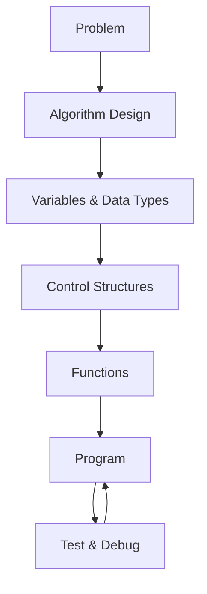
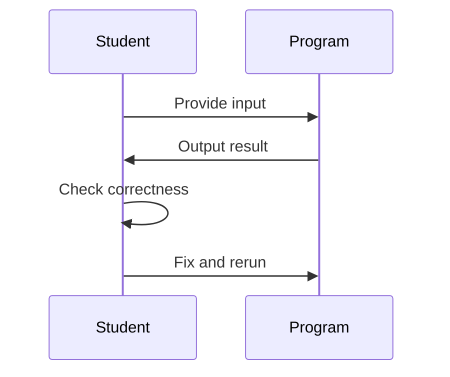

# Year 11 Software Engineering: Unit 1: Programming Fundamentals

Programming Fundamentals introduces core computational thinking, problem‑solving, and coding skills. 

Students learn variables, data types, control structures, functions, and structured program design while developing confidence in writing, testing, and refining simple software solutions.
  
This unit introduces the essential building blocks of programming. You will learn how to design, write, test, and refine simple software solutions using structured programming techniques.

---

## 🎯 Learning Outcomes
By the end of this unit, you will be able to:
- Use variables, data types, and operators  
- Apply sequence, selection, and iteration  
- Write and call functions  
- Use input/output to interact with users  
- Test and debug simple programs  
- Apply structured problem‑solving techniques  

---

## 🧠 How Programming Concepts Fit Together

---

## 🛠 Tools You Will Use

- GitHub Classroom for managing your code

- Codespaces or local Python installation

- CodeQL for automated code scanning

- VS Code (recommended)

---

## 🚀 Getting Started

1. Read the task instructions in this repository.
2. Open the repo in Codespaces or clone it locally.
3. Run the starter code and explore the examples.
4. Complete the exercises in the tasks/ folder.
5. Commit and push your work regularly.

---
## 🧪 Testing and Debugging

Testing is part of the development process.
Use print statements, sample inputs, and incremental development to verify your logic.

## 📤 Submitting Your Work

Your submission is complete when:

- Your code is committed
- Your final work is pushed to GitHub
- Your teacher can see your last commit before the deadline

There is no separate upload step.

---

❓ Need Help?

Ask in class, bring your laptop, and be ready to show your code.
Programming is learned by doing — small steps, frequent testing, and steady improvement.

