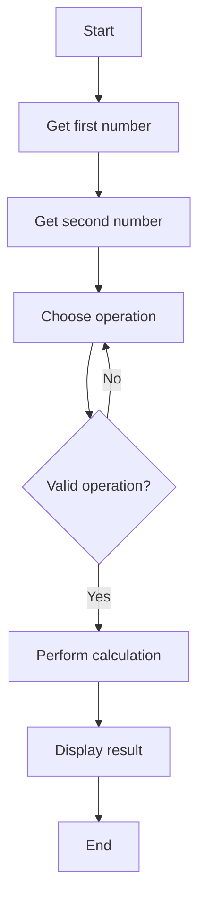

# Calculator Program Flowchart

```mermaid
flowchart TD
    A[Start] --> B[Get first number]
    B --> C[Get second number]
    C --> D[Choose operation]
    D --> E{Valid operation?}
    E -- No --> D
    E -- Yes --> F[Perform calculation]
    F --> G[Display result]
    G --> H[End]
```
