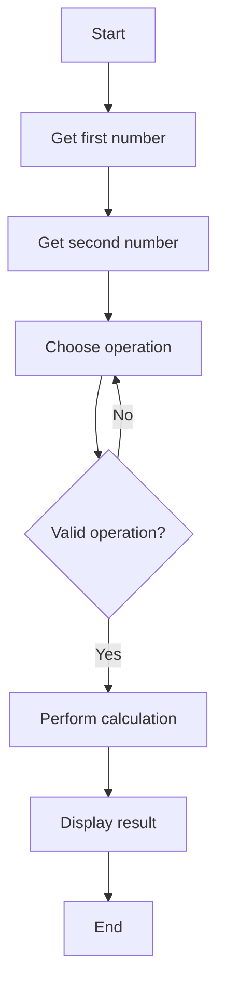

# Task — Interactive Calculator

## Overview
In this task, you will design and implement a simple interactive calculator program. This activity introduces the core programming concepts of variables, data types, input/output, selection, iteration, and functions.

Your goal is to build a program that:
1. Asks the user for two numbers  
2. Asks the user to choose an operation  
3. Performs the calculation  
4. Displays the result  
5. Handles invalid input safely  

---

## Learning Outcomes
This task helps you develop skills in:
- Designing algorithms using structured steps  
- Using variables and data types  
- Applying sequence, selection, and iteration  
- Writing and calling functions  
- Testing and debugging programs  

---

## Requirements

### 1. Input
- Prompt the user for two numbers  
- Convert input to the correct data type  
- Validate that the input is numeric  

### 2. Control Structures
Use `if/elif/else` to choose the operation.

### 3. Functions
Write at least two functions, for example:
- `calculate(a, b, operation)`
- `display_result(value)`

### 4. Error Handling
Your program must:
- Handle division by zero  
- Handle invalid menu choices  
- Handle non‑numeric input  

### 5. Output
Display the result clearly and professionally.

---

## Example Interaction

Welcome to the Interactive Calculator!

```Enter first number:``` 12

```Enter second number:``` 5

```Choose operation (+, -, *, /):``` *

```Result:``` 12 * 5 = 60

---

## Algorithm Flow (Mermaid Diagram)



## Submission

Your work is submitted automatically when you push your final commit before the deadline.

## Need Help?

Ask in class and be ready to show your code.


---

# ⭐ 5. `checklist.md`

```markdown
# Student Checklist — Interactive Calculator

Use this checklist before submitting your work.

## ✔ Functionality
- [ ] Program asks for two numbers  
- [ ] Program asks for an operation  
- [ ] Program performs the correct calculation  
- [ ] Program displays the result clearly  

## ✔ Error Handling
- [ ] Handles non‑numeric input  
- [ ] Handles invalid operation choices  
- [ ] Handles division by zero  

## ✔ Code Quality
- [ ] Code is neatly formatted  
- [ ] Functions are used appropriately  
- [ ] Variable names are meaningful  
- [ ] Comments explain key sections  

## ✔ Testing
- [ ] Tested with positive numbers  
- [ ] Tested with negative numbers  
- [ ] Tested with zero  
- [ ] Tested with invalid input  

## ✔ GitHub
- [ ] All work committed  
- [ ] Final version pushed to GitHub  
```
